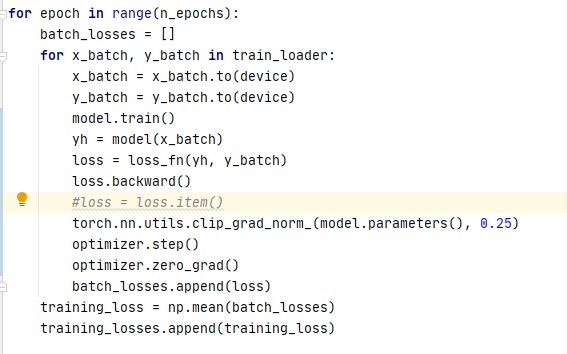
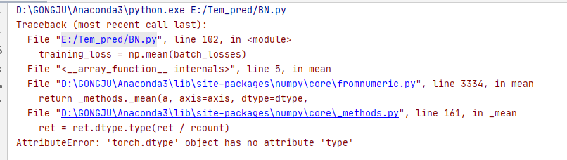
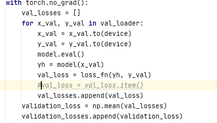
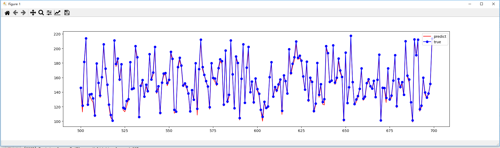
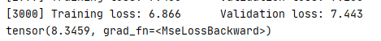
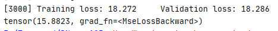

1.如果不加`loss=loss.item（）`的话，就会报错

​	但是在`validation_dataset`中加不加`loss = loss.item()`都可以运行，不知道是因为啥。

2.

在测试集中，预测值曲线和真实值曲线的趋势完全一样，是因为过拟合了吗？Adam优化器中加了weight_decay，我从书中看的weight_decay就有L2正则化的作用，不知道是不是过拟合了。。。还有个问题就是，同样的代码，每次运行，最终MSE结果都不一样，这正常吗。。。

